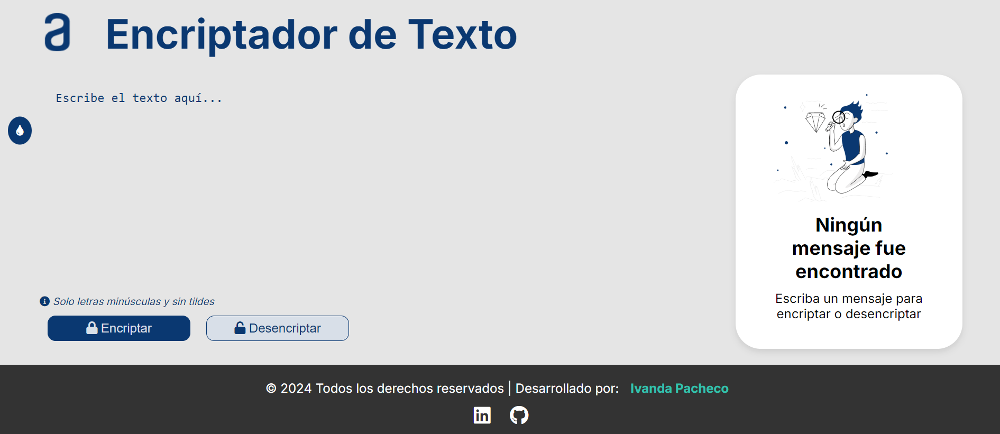

# Encriptador de Texto


## Descripción

**Encriptador de Texto** es una aplicación web que permite encriptar y desencriptar mensajes de manera sencilla y rápida. Utiliza un sistema de sustitución de vocales por sílabas específicas, lo que hace que los mensajes sean difíciles de leer sin desencriptar. Ideal para mantener la privacidad de tus comunicaciones.

## Tecnologías Utilizadas

- **HTML5**: Estructura de la aplicación.
- **CSS3**: Estilos y diseño responsivo.
- **JavaScript**: Lógica de encriptación, desencriptación y manipulación del DOM.
- **FontAwesome**: Iconos para mejorar la interfaz de usuario.
- **Google Fonts**: Tipografía personalizada.

## Características

- **Encriptación de Texto**: Convierte las vocales en sílabas específicas para proteger tu mensaje.
- **Desencriptación de Texto**: Restaura el mensaje original a partir del texto encriptado.
- **Copia al Portapapeles**: Copia el texto encriptado o desencriptado con un solo clic.
- **Interfaz Responsiva**: Diseño adaptable para dispositivos móviles y de escritorio.

## Uso

### Encriptar un Mensaje

1. Escribe tu mensaje en el área de texto.
2. Haz clic en el botón **"Encriptar"**.
3. El mensaje encriptado aparecerá en el área de resultados.

### Desencriptar un Mensaje

1. Escribe el mensaje encriptado en el área de texto.
2. Haz clic en el botón **"Desencriptar"**.
3. El mensaje desencriptado aparecerá en el área de resultados.

### Copiar el Mensaje

1. Haz clic en el botón **"Copiar"** para copiar el mensaje encriptado o desencriptado al portapapeles.

## Instalación

1. Clona este repositorio en tu máquina local:
    ```bash
    git clone https://github.com/ivandapacheco/encriptador-de-texto.git
    ```
2. Abre el archivo `index.html` en tu navegador web.

## Capturas de Pantalla

### Vista Principal


## Contacto

Desarrollado por [Ivanda Pacheco](https://www.linkedin.com/in/ivanda-pacheco/). Puedes encontrarme en:
[](https://www.linkedin.com/in/ivanda-pacheco/)
[](https://github.com/ivandapacheco)


## Licencia

Este proyecto está bajo la Licencia MIT. Para más información, consulta el archivo [LICENSE](LICENSE).
